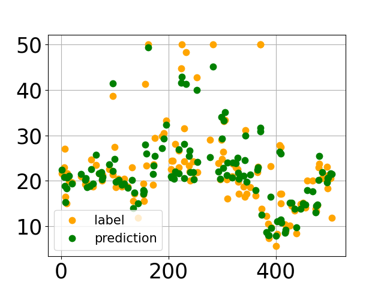

# 波士顿房价预测-随机森林模型

## 实验准备

安装所需要的库：sklearn

参考[Introduction · sklearn 中文文档 (apachecn.org)](https://sklearn.apachecn.org/)进行安装

安装这个库之前需要先行安装numpy和scipy，参考[Numpy及Scipy的安装](https://blog.csdn.net/qq_36560826/article/details/104826111?utm_medium=distribute.pc_relevant.none-task-blog-2~default~baidujs_baidulandingword~default-0.no_search_link&spm=1001.2101.3001.4242)发现不能直接pip安装，需要去https://www.lfd.uci.edu/~gohlke/pythonlibs里安装.whl文件

需要安装自己的python和电脑系统对应的版本

```
python --version#查看python版本
pip debug --verbose#查看自己能安装的版本
```

注意更新自己的pip

然后把下载好的文件放到在python的安装目录下面scripts文件夹下，打开powershell，参考[最详细的NumPy安装流程](https://blog.csdn.net/sinat_26933727/article/details/68953193)在命令行中输入

```
 pip install \**.whl #你的whl文件所在路径 \ xxx.whl
```

进行安装

安装完成后可以import一下，没有消息就是最好的消息，安装完成

### 数据集摘要

| -              | -                                                            |
| -------------- | :----------------------------------------------------------- |
| 名称           | 波士顿房价数据集（Boston House Prices dataset）              |
| 特征简介       | CRIM - 城镇人均犯罪率<br/>ZN - 占地面积超过25,000平方英尺的住宅用地比例<br/>INDUS - 每个城镇非零售业务的比例<br/>CHAS - Charles River虚拟变量<br/>NOX - 一氧化氮浓度（每千万份）<br/>RM - 每间住宅的平均房间数<br/>AGE - 1940年以前建造的自住单位比例<br/>DIS - 波士顿的五个就业中心加权距离<br/>RAD - 径向高速公路的可达性指数<br/>TAX - 每10,000美元的全额物业税率<br/>PTRATIO - 城镇的学生与教师比例<br/>B - $ 1000*(Bk - 0.63)^2$其中Bk是城镇黑人的比例<br/>LSTAT - 区域中被认为是低收入阶层的比率<br/>MEDV - 自有住房的中位数报价, 单位1000美元 |
| 记录数         | 506条                                                        |
| 分析目标       | 建立一个从已知特征预测波士顿未知房价的模型                   |
| 分析思路和方法 | 采用随机森林对房价进行预测，同时筛选出影响波士顿房价的主要因素 |

## 实验过程

### 数据导入与基本信息查看

#### 导入数据

  利用sklearn加载其自带的boston数据集。

```python
    from sklearn.datasets import load_boston
    boston = load_boston()
```

#### 数据初步处理

  将原来数据中的data项和prices项合并成一个新数据集。

```python
    #数据提取
    data_df = pd.DataFrame(data,columns=feature_names)
    prices_df = pd.DataFrame(prices,columns=['MEDV'])
    boston_df = pd.DataFrame(data_df)
    boston_df['MEDV'] = prices
    boston_df.describe()
```

#### 数据空缺值检查

  通过pandas的info()函数查看数据集中是否存在空缺值和数据集中各变量的属性。从结果可看出，无缺失值且各特征数值为float类型。

```python
    boston_df.info()
```

### 波士顿房价预测

#### 随机森林

##### 模型搭建

```python
    from sklearn.ensemble import RandomForestRegressor
    from sklearn.model_selection import GridSearchCV
    param_grid = {
        'n_estimators':[5,10,20,50,100,200],#决策树的个数
        'max_depth':[3,5,7],#最大树深
        'max_features':[0.6,0.7,0.8,1]#特征采用划分
    }
    rf = RandomForestRegressor()
    grid = GridSearchCV(rf,param_grid=param_grid,cv=3)
    grid.fit(X_train,y_train)
```

##### 作出最优树图

```python
    from sklearn import tree
    import pydotplus
    from IPython.display import Image,display

    rf_reg = grid.best_estimator_
    estimator = rf_reg.estimators_[3]
    dot_data = tree.export_graphviz(estimator,out_file=None,filled=True,rounded=True)

    graph = pydotplus.graph_from_dot_data(dot_data)

    graph.write_pdf('boston_price_predict_tree.pdf')
    display(Image(graph.create_png()))
```

##### 预测集拟合散点图绘制

```python
    result['label'].plot(style='k.',c='orange',markersize=15)
    result['prediction'].plot(style='r.',c='green',markersize=15)
    plt.legend(fontsize=15,markerscale=1)
    plt.tick_params(labelsize=25)
    plt.grid()
    plt.savefig("随机森林拟合结果.png")
```



##### 特征重要度排行图

```python
    feature_importances = rf_reg.feature_importances_
    indices = np.argsort(feature_importances)[::-1]
    sns.barplot(feature_names[indices],feature_importances[indices])
    plt.savefig("features_importance.png")
```


##### 随机森林模型评估

```python
    #最优树模型参数
    print("Best Params : {}".format(grid.best_params_))
    #可决系数
    print("R Square : {}".format(grid.best_score_))
    #均根方差
    MSE = metrics.mean_squared_error(y,rf_reg.predict(X))
    RMSE = np.sqrt(MSE)
    print("RMSE : {}".format(RMSE))
    Best Params : {'max_depth': 7, 'max_features': 0.6, 'n_estimators': 200}
    R Square : 0.8654507915978027
    RMSE : 2.5590515715912807
```

## 结果分析

### 分析各特征与波士顿房价(MEDV)之间的相关性

1.城镇犯罪率(CRIM)越低位置，房价越高。
2.占地面积超过25,000平方英尺的住宅用地比例(ZN)与房价之间相关性较低
3.每个城镇非零售业务的比例(INDUS)较高位置，房价较低。但是，在INDUS较低的位置，也存在较低房价。
4.Charles River虚拟变量(CHAS)流域附近房价有高有低。
5.一氧化氮浓度(NOX)与房价相关性不明显。
6.每间住宅的平均房间数(RM)与房价呈正相关，房间数越多，房价越高。
7.1940年以前建造的自住单位比例(AGE)与房价相关性不高
8.波士顿的五个就业中心加权距离(DIS)越高，房价越高，但大部分房子的DIS处于4以下。
9.径向高速公路的可达性指数(RAD)与房价无相关性
10.每10,000美元的全额物业税率(TAX)处于400以下，房价有高有低。
11.城镇的学生与教师比例(PTRATIO)较高，低价房源也越多。
12.1000（Bk - 0.63）^2其中Bk是城镇黑人的比例(B)大多处于400左右，房价也在集中在2~4万美元。
13.区域中被认为是低收入阶层的比率(LSTAT)与房价呈负相关，LSTAT越高，房价越低。