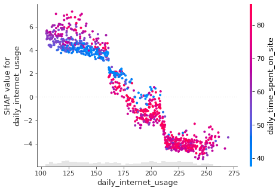

# SHAP解释广告点击预测模型

## Shapley值是什么？

Shapley值是博弈论中使用的一种方法，它涉及公平地将收益和成本分配给在联盟中工作的行动者。

由于每个行动者对联盟的贡献是不同的，Shapley值保证每个行动者根据贡献的多少获得公平的份额。


Shapley值被广泛地应用于求解群体中每个工人(特征)的贡献问题，能起到特征权重测度的作用。

## SHAP解释广告点击预测模型原理

首先训练一个机器学习模型来预测广告是否被特定的人点击。在收到关于某人的一些信息后，模型预测某人不会点击广告。

如果我们想要知道不同广告策略中每种广告对收入的贡献值，我们就可以采用Shapley值的计算方法。

每个策略在特定月份的收入是：

- 无广告：150美元
- 社交媒体：300美元
- 谷歌广告：200美元
- 电子邮件营销：350美元
- 社交媒体和谷歌广告：320美元
- 社交媒体和电子邮件营销：400美元
- 谷歌广告和电子邮件营销：350美元
- 电子邮件营销，谷歌广告和社交媒体：450美元


使用三则广告与不使用广告的收入相差300美元，每则广告对这一差异有多大的贡献?


我们可以通过计算每一类广告的Shapley值来计算谷歌广告对公司收入的总贡献入手，通过公式可以计算出Google广告的总贡献：


### 寻找谷歌广告的边际贡献

第一，我们将发现谷歌广告对以下群体的边际贡献：

- 无广告
- 谷歌广告+社交媒体
- 谷歌广告+电子邮件营销
- 谷歌广告+电子邮件营销+社交媒体


Google广告 对 无广告 的边际贡献是：


谷歌广告 对 谷歌广告&社交媒体组合 的边际贡献是：


谷歌广告 对 谷歌广告&电子邮件营销组合 的边际贡献是：


谷歌广告 对 谷歌广告、电子邮件营销和社交媒体组合 的边际贡献是：


### 发现权重

为了发现权重，我们将把不同广告策略的组合组织成如下多个层次，每个层次对应于每个组合中广告策略的数量。

然后根据每个层次的边数分配权重，我们看到了这一点：

- 第一级包含3条边，因此每个边的权重为1/3
- 第二级包含6条边，因此每条边的权重将为1/6
- 第三级包含3条边，因此每条边的权重将为1/3


### 发现Google广告的总贡献

根据前面的权重和边际贡献，我们已经可以找到Google广告的总贡献!


酷!所以谷歌广告在使用3种广告策略与不使用广告的总收入差异中贡献了36.67美元。36.67是Google广告的Shapey值。


重复以上步骤，对于另外两种广告策略，我们可以看出：

- 电子邮件营销贡献151.67美元
- 社交媒体贡献116.67美元
- 谷歌广告贡献36.67美元


## python实现
SHAP是一个 Python 库，它使用 Shapley 值来解释任何机器学习模型的输出。
安装shap


```python
pip install shap
```


## 训练模型
为了理解SHAP工作原理，我们使用Kaggle平台内的advertising广告数据集。


```python
import pandas as pd 

df = pd.read_csv("advertising.csv")
df.head()
```

<table border="1" class="dataframe">
  <thead>
    <tr style="text-align: right;">
      <th></th>
      <th>daily_time_spent_on_site</th>
      <th>age</th>
      <th>area_income</th>
      <th>daily_internet_usage</th>
      <th>ad_topic_line</th>
      <th>city</th>
      <th>male</th>
      <th>country</th>
      <th>timestamp</th>
      <th>clicked_on_ad</th>
    </tr>
  </thead>
  <tbody>
    <tr>
      <th>0</th>
      <td>68.95</td>
      <td>35</td>
      <td>61833.90</td>
      <td>256.09</td>
      <td>Cloned 5thgeneration orchestration</td>
      <td>Wrightburgh</td>
      <td>0</td>
      <td>Tunisia</td>
      <td>2016-03-27 00:53:11</td>
      <td>0</td>
    </tr>
    <tr>
      <th>1</th>
      <td>80.23</td>
      <td>31</td>
      <td>68441.85</td>
      <td>193.77</td>
      <td>Monitored national standardization</td>
      <td>West Jodi</td>
      <td>1</td>
      <td>Nauru</td>
      <td>2016-04-04 01:39:02</td>
      <td>0</td>
    </tr>
    <tr>
      <th>2</th>
      <td>69.47</td>
      <td>26</td>
      <td>59785.94</td>
      <td>236.50</td>
      <td>Organic bottom-line service-desk</td>
      <td>Davidton</td>
      <td>0</td>
      <td>San Marino</td>
      <td>2016-03-13 20:35:42</td>
      <td>0</td>
    </tr>
    <tr>
      <th>3</th>
      <td>74.15</td>
      <td>29</td>
      <td>54806.18</td>
      <td>245.89</td>
      <td>Triple-buffered reciprocal time-frame</td>
      <td>West Terrifurt</td>
      <td>1</td>
      <td>Italy</td>
      <td>2016-01-10 02:31:19</td>
      <td>0</td>
    </tr>
    <tr>
      <th>4</th>
      <td>68.37</td>
      <td>35</td>
      <td>73889.99</td>
      <td>225.58</td>
      <td>Robust logistical utilization</td>
      <td>South Manuel</td>
      <td>0</td>
      <td>Iceland</td>
      <td>2016-06-03 03:36:18</td>
      <td>0</td>
    </tr>
  </tbody>
</table>
</div>


先建立一个机器学习模型, 该模型根据用户个人特质信息来预测其是否点击广告。
使用Patsy将DataFrame转换为一组特征和一组目标值：


```python
pip install future
```

```python
from patsy import dmatrices
from sklearn.model_selection import train_test_split

y, X = dmatrices(
    "clicked_on_ad ~ daily_time_spent_on_site + age + area_income + daily_internet_usage  + male -1",
    data=df,
)

X_frame = pd.DataFrame(data=X, columns=X.design_info.column_names)


```

把数据分为测试集和训练集


```python
X_train, X_test, y_train, y_test = train_test_split(X, y, test_size=0.2, random_state=7)
```

接下来使用XGBoost训练模型，并做预测


```python
import xgboost
model = xgboost.XGBClassifier().fit(X_train, y_train)
y_predicted = model.predict(X_test)
```


为了查看模型表现，我们使用F1得分


```python
from sklearn.metrics import f1_score

f1 = f1_score(y_test, y_predicted)
f1
```


    0.9619047619047619


## 解释该模型
该模型很好地预测了用户是否点击广告。但它是如何得出这样的预测的? **每个特征对最终预测与平均预测的差异贡献了多少?**

注意，这个问题与我们在文章开头论述的问题非常相似。

因此，寻找每个特征的Shapley值可以帮助我们确定它们的贡献。得到特征i的重要性的步骤与之前类似，其中i是特征的索引：

- 获取所有不包含特征i的子集
- 找出特征i对这些子集中每个子集的边际贡献
- 聚合所有边际贡献来计算特征i的贡献

若要使用SHAP查找Shapley值，只需将训练好的模型插入shap.Explainer


```python
import shap

explainer = shap.Explainer(model)
shap_values = explainer(X_frame)
```


## SHAP瀑布图
可视化第一个预测的解释：


```python
#第一条记录是未点击
shap.plots.waterfall(shap_values[0])
```


    


现在我们知道每个特征对第一次预测的贡献。对上图的解释：


- 蓝色条显示某一特定特征在多大程度上降低了预测的值。
- 红条显示了一个特定的特征在多大程度上增加了预测值。
- 负值意味着该人点击广告的概率小于0.5

我们应该期望总贡献等于预测与均值预测的差值。我们来验证一下：


验证成功！

可视化第二个预测的解释：


```python
#第二条记录也是未点击
shap.plots.waterfall(shap_values[1])
```


    


## SHAP摘要图
我们可以使用SHAP摘要图，而不是查看每个单独的实例，来可视化这些特性对多个实例的整体影响：


```python
shap.summary_plot(shap_values, X)
```


    


SHAP摘要图告诉我们数据集上最重要的特征及其影响范围。

从上面的情节中，我们可以对模型的预测获得一些有趣的见解：
- 用户的 **daily_internet_usage** 对该用户是否点击广告的影响最大。
- 随着**daily_time_spent_on_site**的增加，用户点击广告的可能性降低。
- 随着**area_income**的增加，用户点击广告的可能性降低。
- 随着**age**的增长，用户更容易点击广告。
- 如果用户是**male**，则该用户点击广告的可能性较小。

## SHAP条形图
我们还可以使用SHAP条形图得到全局特征重要性图。


```python
shap.plots.bar(shap_values)
```


    


## SHAP 依赖散点图
我们可以使用 SHAP 依赖散点图观察单个特征对模型所做的所有预测的影响。
日常互联网使用
每日互联网使用特征的散点图：


```python
shap.plots.scatter(shap_values[:, "daily_internet_usage"])
```


    


从上图中，我们可以看到，随着每日互联网使用量的增加，每日互联网使用量的 SHAP 值会下降。这证实了我们在前面的图中看到的内容。
我们还可以通过添加 来观察日常互联网使用特征与同一图中其他特征之间的相互作用color=shap_values。
散点图将尝试挑选出与日常互联网使用交互最强的特征列，即每天在网站上花费的时间。


```python
shap.plots.scatter(shap_values[:, "daily_internet_usage"], color=shap_values)
```



    


## SHAP 交互图
我们还可以使用 SHAP 交互值汇总图观察特征之间的交互矩阵。


```python
# Get interaction values
shap_interaction_values = explainer.shap_interaction_values(X)

# Summarize the interaction values
shap.summary_plot(shap_interaction_values, X_frame)
```


    


## 实验总结
上面案例运用shapley值的计算方法的原理，使用python中的SHAP库，解释了广告点击预测模型。使用python中的SHAP库的主要优点是，当将 Shapley 值应用于机器学习时，它能够更有效地计算 Shapley 值。可以看出，shapley值在机器学习模型可解释性的应用上效果很好。

