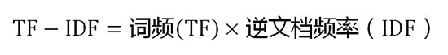
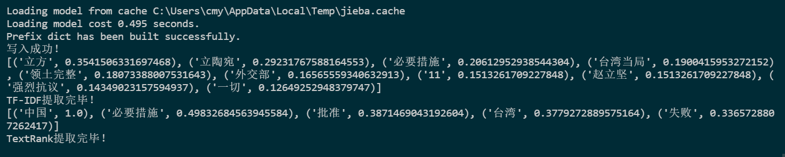

# 文本分析实验

## 实验要求

使用Jieba包，首先进行中文文本分词，然后实现TextRank算法的关键词计算，并对比其与TF-IDF算法在计算结果上的差异，分析差异产生的原因，考虑各自适用的情形。

## 实验原理

### 1.关键字提取：

　　关键词抽取就是从文本里面把跟这篇文档意义最相关的一些词抽取出来。这个可以追溯到文献检索初期，当时还不支持全文搜索的时候，关键词就可以作为搜索这篇论文的词语。因此，目前依然可以在论文中看到关键词这一项。

　　除了这些，关键词还可以在文本聚类、分类、自动摘要等领域中有着重要的作用。比如在聚类时将关键词相似的几篇文档看成一个团簇，可以大大提高聚类算法的收敛速度；从某天所有的新闻中提取出这些新闻的关键词，就可以大致了解那天发生了什么事情；或者将某段时间内几个人的微博拼成一篇长文本，然后抽取关键词就可以知道他们主要在讨论什么话题。

　　目前大多数领域无关的关键词抽取算法（领域无关算法的意思就是无论什么主题或者领域的文本都可以抽取关键词的算法）和它对应的库都是基于后者的。从逻辑上说，后者比前着在实际使用中更有意义。

从算法的角度来看，关键词抽取算法主要有两类：

- 有监督学习算法，将关键词抽取过程视为二分类问题，先抽取出候选词，然后对于每个候选词划定标签，要么是关键词，要么不是关键词，然后训练关键词抽取分类器。当新来一篇文档时，抽取出所有的候选词，然后利用训练好的关键词抽取分类器，对各个候选词进行分类，最终将标签为关键词的候选词作为关键词；
- 无监督学习算法，先抽取出候选词，然后对各个候选词进行打分，然后输出topK个分值最高的候选词作为关键词。根据打分的策略不同，有不同的算法，例如TF-IDF，TextRank等算法；

### 2.TF-IDF算法：

　　TF-IDF（term frequency–inverse document frequency，词频-逆向文件频率）是一种用于信息检索（information retrieval）与文本挖掘（text mining）的常用加权技术。
TF-IDF是一种统计方法，用以评估一字词对于一个文件集或一个语料库中的其中一份文件的重要程度。字词的重要性随着它在文件中出现的次数成正比增加，但同时会随着它在语料库中出现的频率成反比下降。

- 　　TF-IDF的主要思想是：如果某个单词在一篇文章中出现的频率TF高，并且在其他文章中很少出现，则认为此词或者短语具有很好的类别区分能力，适合用来分类。
- 　　TF是词频(Term Frequency)：词频（TF）表示词条（关键字）在文本中出现的频率。
- 　　逆向文件频率 (IDF) ：某一特定词语的IDF，可以由总文件数目除以包含该词语的文件的数目，再将得到的商取对数得到。如果包含词条t的文档越少, IDF越大，则说明词条具有很好的类别区分能力。
- 　　TF-IDF实际上是：TF *IDF。某一特定文件内的高词语频率，以及该词语在整个文件集合中的低文件频率，可以产生出高权重的TF-IDF。因此，TF-IDF倾向于过滤掉常见的词语，保留重要的词语。

　　TF-IDF计算：
     （1）计算词频

　　
     （2）计算逆文档频率

　　
     （3）计算TF-IDF

　　

### 3.TextRank算法：

　　此种算法的一个重要特点是可以脱离语料库的背景，仅对单篇文档进行分析就可以提取该文档的关键词。基本思想来源于Google的PageRank算法。这种算法是1997年，Google创始人拉里.佩奇和谢尔盖.布林在构建早期的搜索系统原型时提出的一种链接分析算法，基本思想有两条：
　　1）链接数量。一个网页被越多的其他网页链接，说明这个网页越重要.
　　2）链接质量。一个网页被一个越高权值的网页链接，也能表明这个网页越重要.

　　**TextRank 用于关键词提取的算法如下：**
   （1）把给定的文本 T 按照完整句子进行分割，即:T=[S1,S2,…,Sm]
   （2）对于每个句子，进行分词和词性标注处理，并过滤掉停用词，只保留指定词性的单词，如名词、动词、形容词，其中 ti,j 是保留后的候选关键词。Si=[ti,1,ti,2,...,ti,n]
   （3）构建候选关键词图 G = (V,E)，其中 V 为节点集，由（2）生成的候选关键词组成，然后采用共现关系（Co-Occurrence）构造任两点之间的边，两个节点之间存在边仅当它们对应的词汇在长度为K 的窗口中共现，K表示窗口大小，即最多共现 K 个单词。
   （4）根据 TextRank 的公式，迭代传播各节点的权重，直至收敛。
   （5）对节点权重进行倒序排序，从而得到最重要的 T 个单词，作为候选关键词。
   （6）由（5）得到最重要的 T 个单词，在原始文本中进行标记，若形成相邻词组，则组合成多词关键词。

## 实验过程

1.使用`pip install jieba`安装jieba包

2.编写python代码实现

```python
import jieba
import jieba.analyse
from jieba import analyse
textrank = analyse.textrank  #引入jieba中的TextRank
# 待分词的文本路径
sourceTxt = 'source.txt'
# 分好词后的文本路径
targetTxt = 'target.txt'

# 对文本进行操作
with open(sourceTxt, 'r', encoding = 'utf-8') as sourceFile, open(targetTxt, 'a+', encoding = 'utf-8') as targetFile:
    for line in sourceFile:
        seg = jieba.cut(line.strip(), cut_all = False)
        # 分好词之后之间用空格隔断
        output = ' '.join(seg)
        targetFile.write(output)
        targetFile.write('\n')
    print('写入成功！')

# 使用TF-IDF提取关键词
with open(targetTxt, 'r', encoding = 'utf-8') as file:
    text = file.readlines()
    """
    几个参数解释：
        * text : 待提取的字符串类型文本
        * topK : 返回TF-IDF权重最大的关键词的个数，默认为20个
        * withWeight : 是否返回关键词的权重值，默认为False
        * allowPOS : 包含指定词性的词，默认为空
    """
    keywords1 = jieba.analyse.extract_tags(str(text), topK = 10, withWeight=True, allowPOS=())
    print(keywords1)
    print('TF-IDF提取完毕！')


#使用Textrank进行关键词提取
    """
    参数解释：
        * text : 待提取的字符串类型文本
        * topK : 返回TextRank权重最大的关键词的个数，默认为20个
        * withWeight : 是否返回关键词的权重值，默认为False
        * allowPOS : 包含指定词性的词，默认为('ns', 'n', 'vn', 'v')
                     即仅提取地名、名词、动名词、动词
    """
    keywords2 = textrank(str(text),topK=5, withWeight=True, allowPOS=('ns', 'n', 'vn', 'v'))
    print(keywords2)
    print('TextRank提取完毕！')
	
```

运行结果：



## 对比总结

- TFIDF的IDF值依赖于语料环境,这给他带来了统计上的优势,即它能够预先知道一个词的重要程度.这是它优于textrank的地方.
  而textrank只依赖文章本身,它认为一开始每个词的重要程度是一样的.
- TFIDF是纯粹用词频的思想(无论是TF还是IDF都是)来计算一个词的得分,最终来提取关键词,完全没有用到词之间的关联性.
  而textrank用到了词之间的关联性(将相邻的词链接起来),这是其优于TFIDF的地方.
- TextRank与TFIDF均严重依赖于分词结果——如果某词在分词时被切分成了两个词，那么在做关键词提取时无法将两个词黏合在一起（TextRank有部分黏合效果，但需要这两个词均为关键词）。因此是否添加标注关键词进自定义词典，将会造成准确率、召回率大相径庭。
- TextRank的效果并不优于TFIDF。
- TextRank虽然考虑到了词之间的关系，但是仍然倾向于将频繁词作为关键词。
- 对于TFIDF算法来说，如果对当前现有的文本数据进行关键词提取，就可以使用当前的语料计算各个词语的权重，获取对应文档的关键词，而对于已经有了一部分语料，提取新文本的关键词的话，新文本中的关键词提取效果比较依赖于已有的语料。
- 对于TextRank来说，如果待提取关键词的文本较长，那么可以直接使用该文本进行关键词提取，不需要相关的语料。当面对提取待关键词的文本较短，例如就是一个句子，那么就需要通过语料数据计算各个词语的重要程度可能更好。
- 除此之外，还需要考虑文本长度等来灵活运用这两种算法。

## 参考链接

- [The PageRank Citation Ranking:Bringing Order to the Web](https://link.zhihu.com/?target=http%3A//ilpubs.stanford.edu%3A8090/422/1/1999-66.pdf)
- [TextRank: Bringing Order into Texts](https://link.zhihu.com/?target=http%3A//web.eecs.umich.edu/~mihalcea/papers/mihalcea.emnlp04.pdf)
- [TextRank——关键词提取](https://link.zhihu.com/?target=https%3A//www.jianshu.com/p/8b27f729e30f)
- [PageRank与TextRank算法](https://link.zhihu.com/?target=https%3A//www.zybuluo.com/evilking/note/902585)

